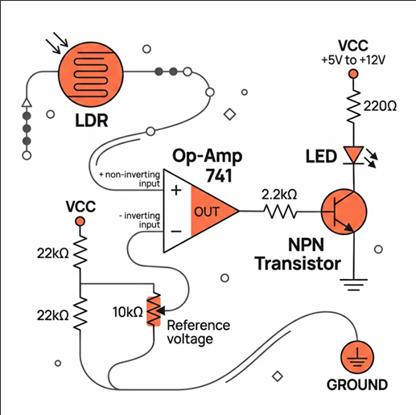
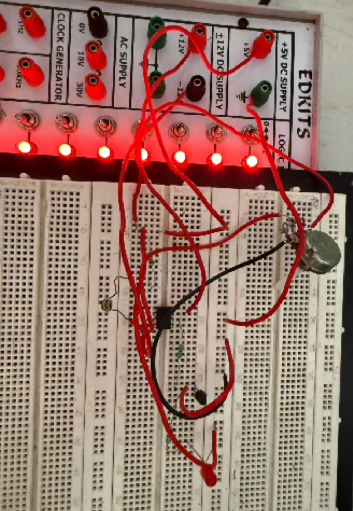
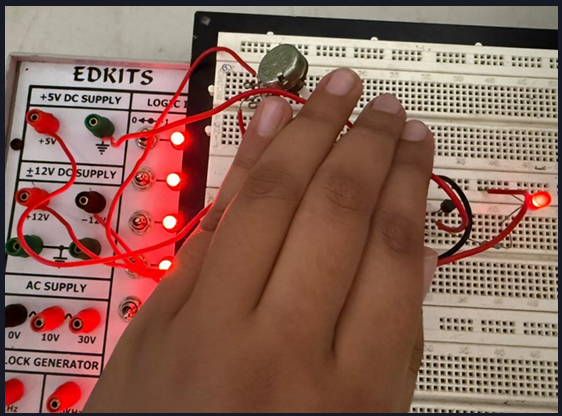

# Automatic Light-Activated LED System Using LDR

## Overview
This mini-project demonstrates an automatic ambient light detection system using Analog Electronics components. The circuit automatically switches an LED ON in darkness and OFF in light using an LDR sensor and an Op-Amp comparator.
This project was developed as part of the Analog Electronics subject in Sem-4 (ECE).

---

## Objective
To design a smart lighting circuit that detects ambient light intensity and automatically controls an LED without using any microcontroller or programming.

---

## Components Used
- Op-Amp IC 741
- LDR (Light Dependent Resistor)
- NPN Transistor
- 10kΩ Potentiometer
- 22kΩ Resistor
- 2.2kΩ Resistor
- 220Ω Resistor
- Red LED
- Trainer Board & Connecting Wires

---

## Working Principle
- The LDR and 22kΩ resistor form a voltage divider circuit.
- The Op-Amp 741 operates as a voltage comparator.
- In darkness, the resistance of the LDR increases.
- This changes the comparator output and activates the transistor.
- The transistor switches the LED ON automatically.

When light intensity increases, the LED turns OFF.

---

## Circuit Diagram

## Hardware

## Hardware Implementation

---

## Applications
- Automatic Street Lighting
- Home Automation Systems
- Smart Energy Saving Systems
- Security Lighting
- Greenhouse Lighting Control

---

## Advantages
- No programming required
- Low-cost implementation
- Energy efficient
- Adjustable sensitivity using potentiometer
- Easy to build and understand

---

## Limitations
- Sensitive to sudden light fluctuations
- No hysteresis control
- Limited output capability

---

## Future Enhancements
- Add relay module for AC appliances
- Use comparator IC for better precision
- Integrate with solar-powered systems
- Add hysteresis for stable switching

---

## Learning Outcomes
- Understanding Op-Amp comparator operation
- Sensor interfacing using LDR
- Analog circuit design basics
- Transistor switching applications

---

## Author
Khushi Desai  
Electronics & Communication Engineering (Sem-4)

---

## Project Type
Mini Project – Analog Electronics# Analog_Electronics-S-4-
Automatic Light-Activated LED System Using LDR (Miniproject)
